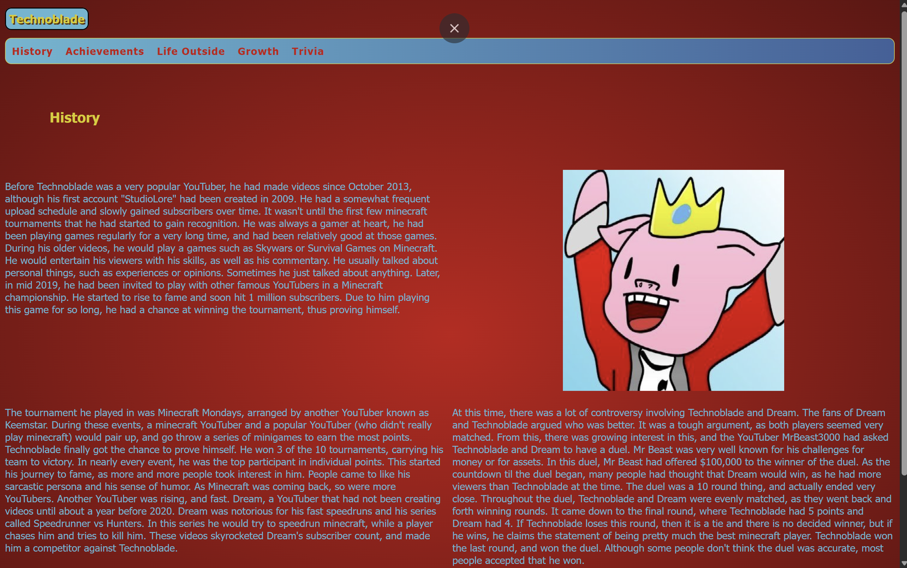
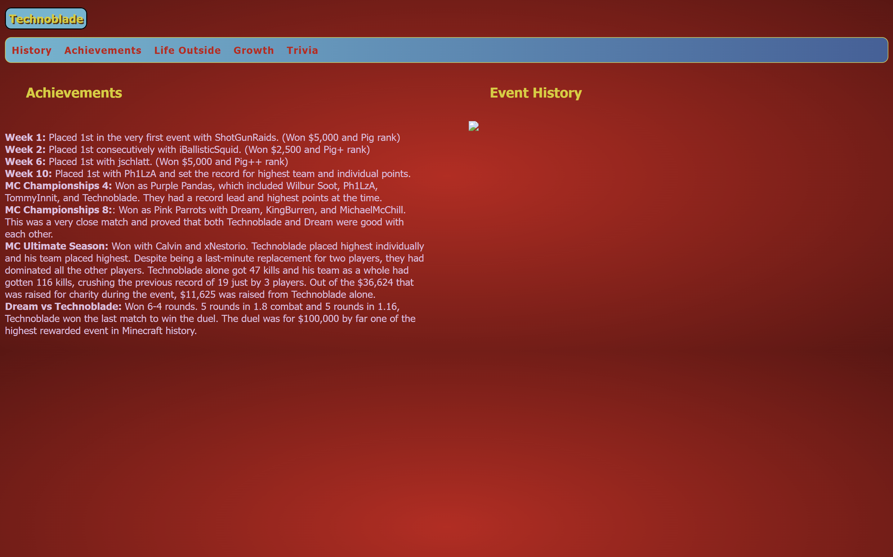
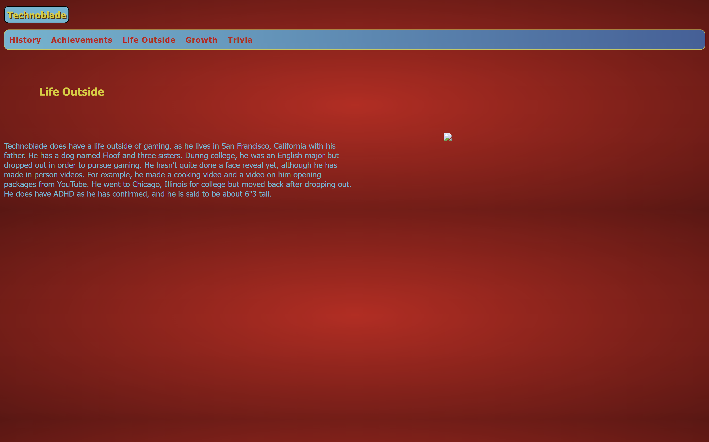
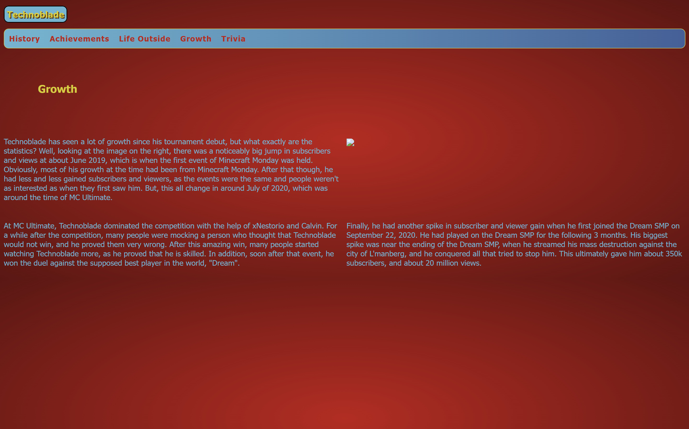
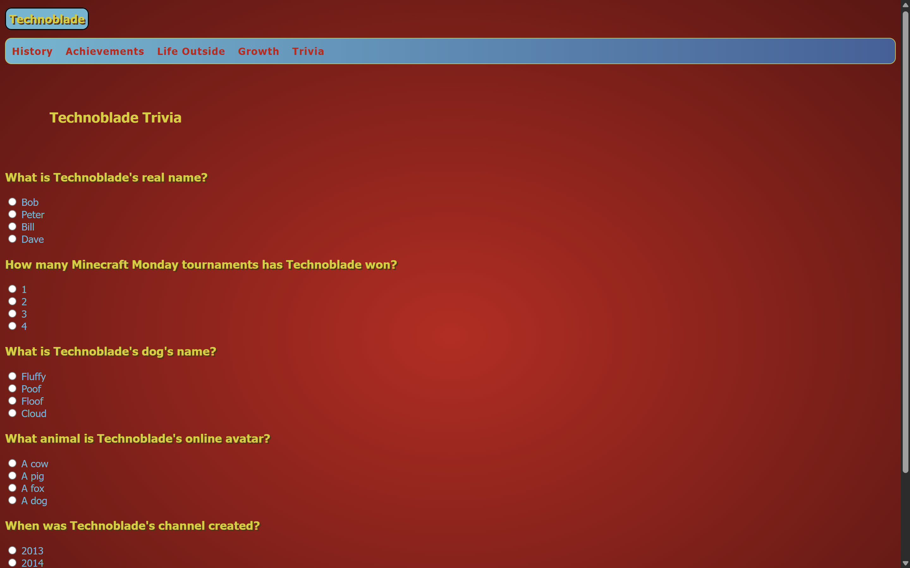

In my first computer science class in high school, I made a website about my favorite YouTuber at the time, Technoblade. My website had information about him, his achievements, history in tournaments, and a short trivia quiz about him. The website is super outdated, so there is a bunch of images and stuff missing. I used repl.it to make this but the link to the websites don't stay up. Below are images of the website. 

I made this project on my own as part of an assignment for my computer science class, where we were tasked to create a website on something we were interested in. I don't remember exactly, but I also think we peer-reviewed each others' websites so I may have gotten feedback from fellow students for this project.

I learned a lot from this project, as I didn't know HTML and CSS before this, so it helped me figure out how it works and how I can customize it to my liking. 

